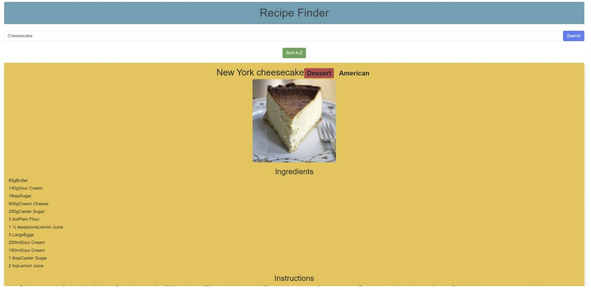
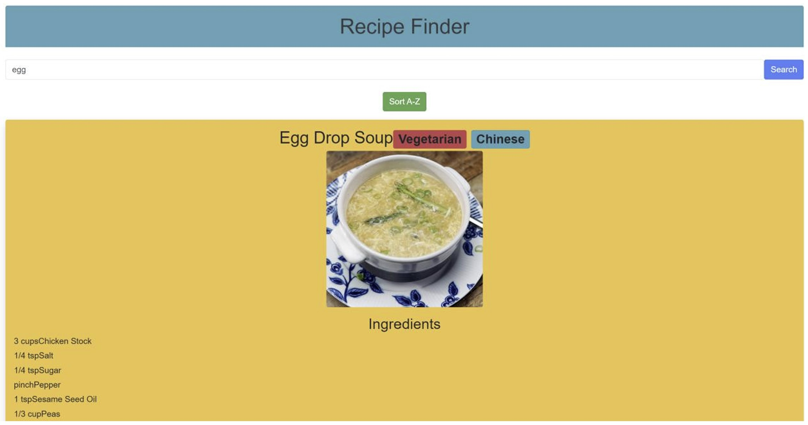
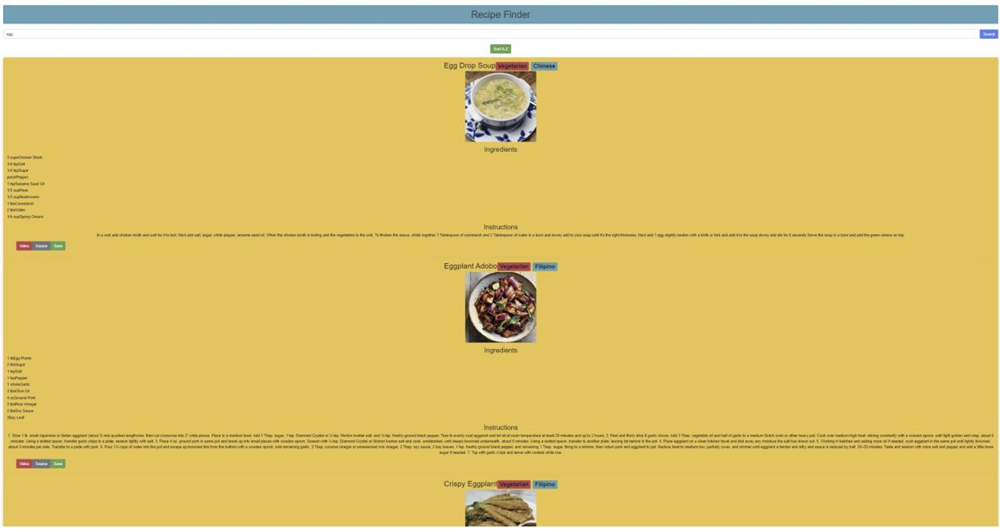
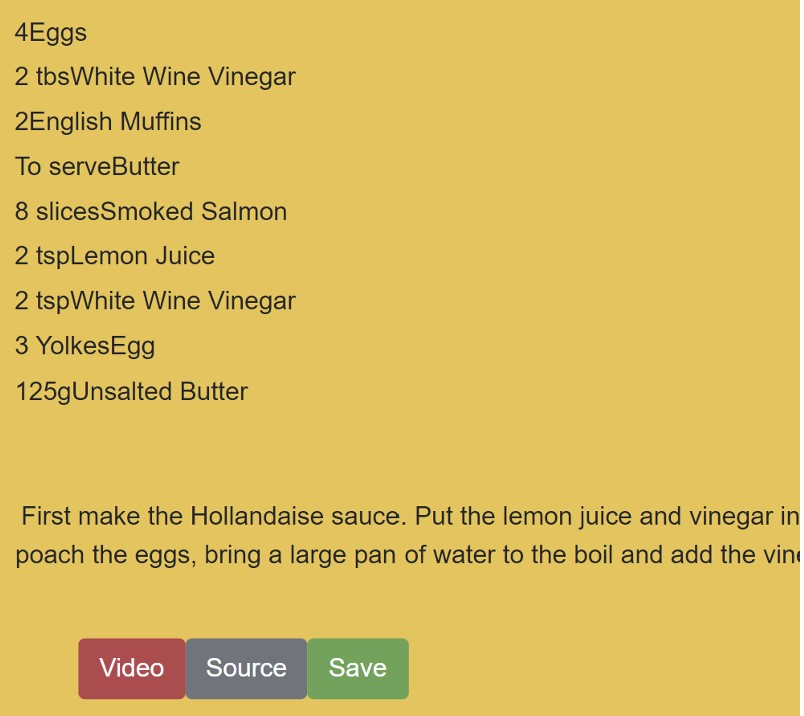
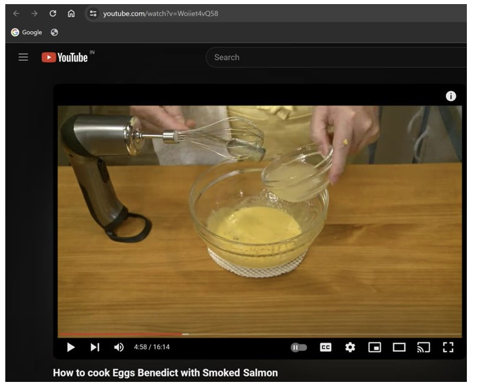
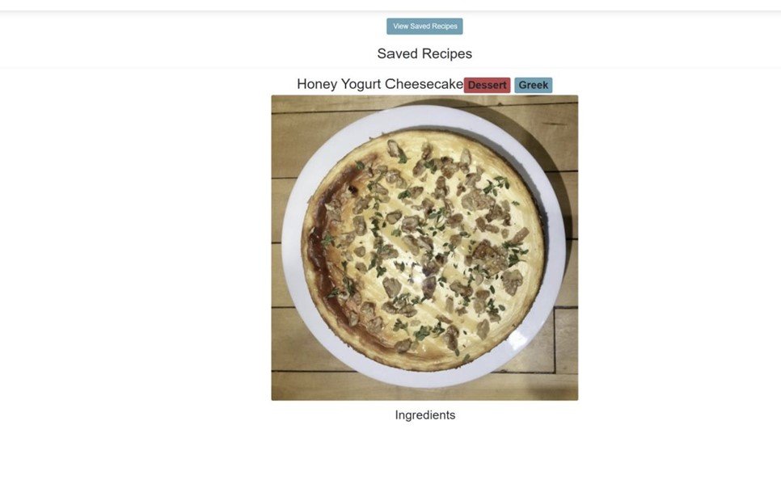
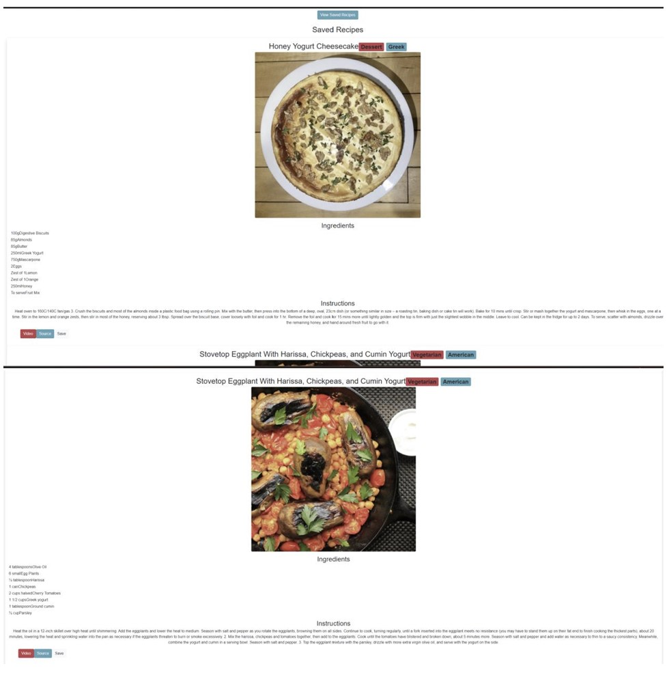
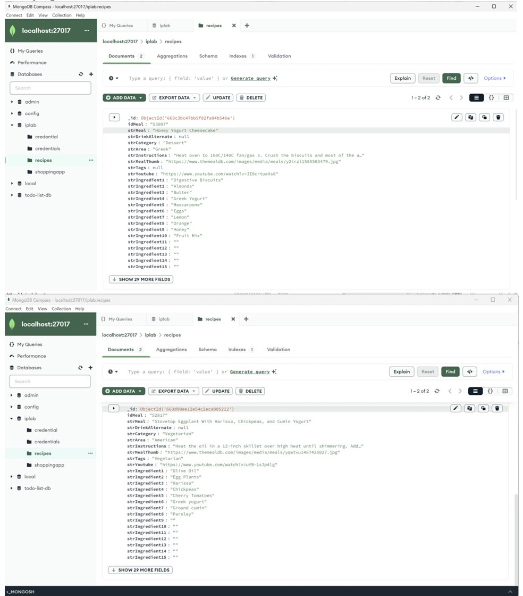

# Recipe Finder Full-Stack Web Application

## Overview
The **Recipe Finder Web Application** enables users to search for recipes by name, view detailed information such as ingredients and instructions, and save their favorite recipes. The app integrates an external API to fetch recipe data and uses a full-stack architecture with **ReactJS**, **Node.js**, and **MongoDB**.

---

## Features
- **Recipe Search**: Search recipes by keywords.
- **Detailed Information**: View ingredients, step-by-step instructions, and related videos for recipes.
- **Sorting**: Sort recipes alphabetically (A-Z or Z-A).
- **Save Recipes**: Save favorite recipes to a personal collection.
- **View Saved Recipes**: Access and manage saved recipes.

---

## Tech Stack
- **Frontend**: ReactJS with Bootstrap for styling.
- **Backend**: Node.js with Express for API endpoints.
- **Database**: MongoDB for storing saved recipes.
- **External API**: [TheMealDB](https://www.themealdb.com/) for fetching recipe data.

---

## Installation and Setup
### Prerequisites
- Node.js and npm
- MongoDB installed locally or access to a MongoDB cluster

### Steps
1. Clone the repository:
   ```bash
   git clone https://github.com/your-repo/recipe-finder.git
   ```
2. Install dependencies for the server and client:
   ```bash
   cd server
   npm install
   cd ../client
   npm install
   ```
3. Configure MongoDB:
   - Update the connection URI in `server.js`:
     ```javascript
     const uri = "mongodb://localhost:27017";
     const dbName = "iplab";
     ```
4. Start the server:
   ```bash
   cd server
   node server.js
   ```
5. Start the frontend:
   ```bash
   cd ../client
   npm start
   ```
6. Access the application in your browser at `http://localhost:3000`.

---

## API Endpoints
| Method | Endpoint               | Description                     |
|--------|-------------------------|---------------------------------|
| POST   | `/api/save-recipe`      | Save a new recipe to the database |
| GET    | `/api/saved-recipes`    | Fetch all saved recipes         |

---

## External API
The application uses **TheMealDB** API to fetch recipe data:
- URL: `https://www.themealdb.com/api/json/v1/1/search.php?s={recipe_name}`

---

## Learning Outcomes
- Built a full-stack application using ReactJS, Node.js, and MongoDB.
- Integrated external APIs for fetching dynamic recipe data.
- Gained experience in managing HTTP requests and responses between the frontend and backend.
- Learned modular programming and best coding practices.

---

## Best Practices
- Designed the app layout and structure before coding.
- Adopted incremental coding for better debugging and modularity.
- Used proper naming conventions, comments, and indentation for code readability.

---

## Output Features
1. **Search Recipes**: Enter keywords and view matching recipes.
2. **View Recipe Details**: See ingredients, instructions, and links to video tutorials.
3. **Save Recipes**: Save preferred recipes for later access.
4. **Sorting**: Organize results in ascending or descending alphabetical order.
5. **View Saved Recipes**: Access previously saved recipes and manage them.

---
### Initital Screen


### Search Functionality



### Video Linking



### Viewing Saved Recipes



## Database

